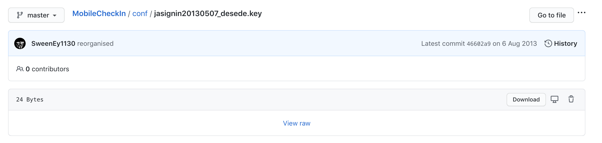
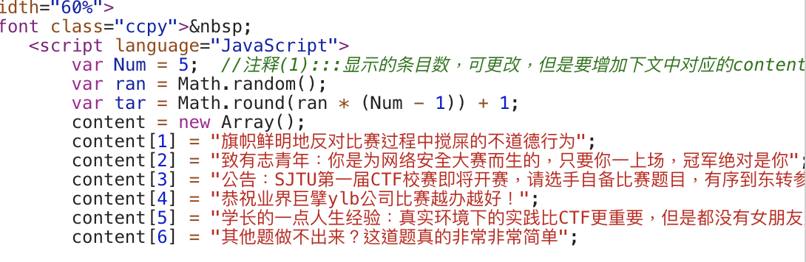

# Old School Website

> 建议使用1024*768以下分辨率浏览！

居然还接入了 jAccount 接口。

这个 `jaLogin` 有个特点就是会传入 `retUrl` 做回调。我觉得或许可以拿这个来做点什么。

首先，拿到的 `retUrl` 格式是这样的：

```
https://jaccount.sjtu.edu.cn/jaccount/jalogin?sid=jasjtu1896111019&returl=CFP9tf4xlX1URRO20zOLKNwZiHysxD4ZA2Ktwiz965efUC8kdRDjk6yHBIvpLIt7%2BA%3D%3D&se=CFOcTtUykD0%2B9gmzac14CVX5akBK2Ndk5sqWrbzZKdTcIInQogT%2FtcPny4WUHn3xxA%3D%3D
```

把 retUrl 解码得到：

```
CFP9tf4xlX1URRO20zOLKNwZiHysxD4ZA2Ktwiz965efUC8kdRDjk6yHBIvpLIt7+A==
```

看起来好像 Base64 啊！但是解码出来完全看不懂。

在[这个项目](https://github.com/SweenEy1130/MobileCheckIn/blob/master/admin.py)里有具体的编码方式：

```python

def keydata():
	f_path = sys.path[0]+"/conf/jasignin20130507_desede.key"
	f = open(f_path,'rb')
	f_data = f.read()
	f.close()
	return f_data

def encrypt(data,iv):
	key = keydata()
	k = triple_des(key,CBC,iv,pad=None,padmode=PAD_PKCS5)
	d = k.encrypt(data)
	data = chr(8)+iv+d
	data = urllib2.quote(base64.b64encode(data))
	return data

def decrypt(data,iv):
	key = keydata()
	try:
		data = base64.b64decode(urllib2.unquote(data))
		data = data[1:]
		d = triple_des(key,CBC,iv,pad=None,padmode=PAD_PKCS5)
		k = d.decrypt(data)
	except TypeError,ValueError:
		raise HTTPError(404)
	return k
```

的确是 Base64，但是在此之前还走了一遍 `triple_des` 的加密。



> 这家伙居然把密钥传上来了…

但是每个项目有独立的密钥，这个肯定不能拿来直接用。

不过可以看到，她这里的 jAccount 请求不是直接发给服务器的，而是通过了 `http://111.186.57.85:30060/jaccount?jatkt=???????` 过了一遍的。非常可疑。

或许我们可以构造一些恶意的 `jatkt` 发给服务器。但是根据那位哥们的代码，这同样也是需要 DES + IV 解密的。



> 你在嘲笑我吗？？？

