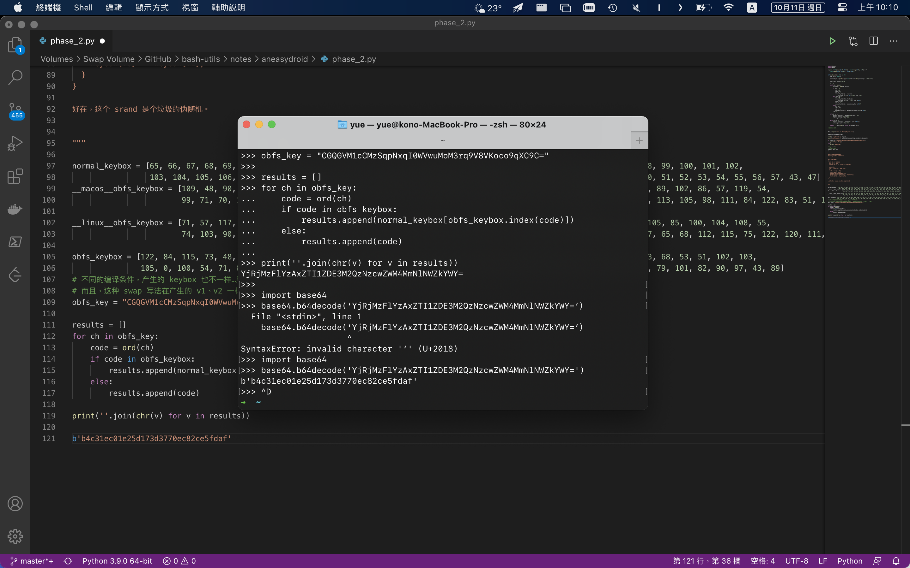

# anEASYdroid

Flag 被拆成了两部分。

第一部分很好办——连续 SHA256，寻章摘句组成 Flag。

> 仿佛看到了出题人不停做杂凑、找合用的字节的场景——这次没有就多 SHA 几次

第二部分是个 Pseudo Base64 编码，改掉了 Keybox。

> 做法是随机「交换」100 次。
>
> > 打引号是因为算法没写好，每次有 $\dfrac 1 {100}$ 的几率把某一位置 0…

但是用的 `srand(NULL)` 是伪随机，所以实际上都是确定的。

> 注意标准库中 `rand` 的实现是平台相关的…就算大家都用一样的种子也可能得到不同的结果。
>
> > 所以特地去写了个 Android 程序跑 Keybox…

