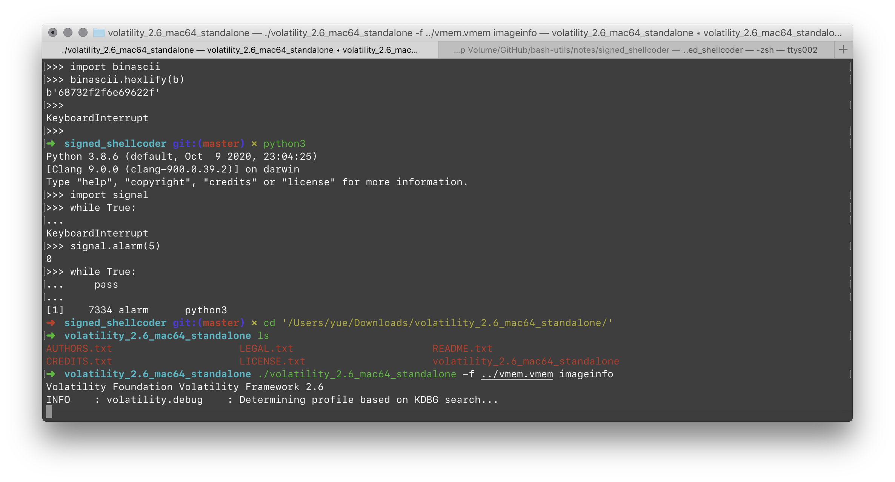
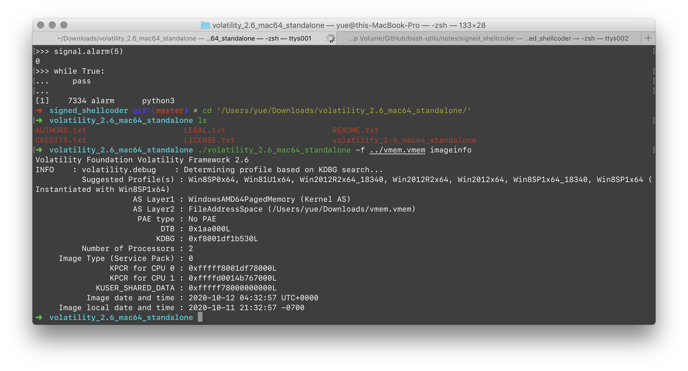
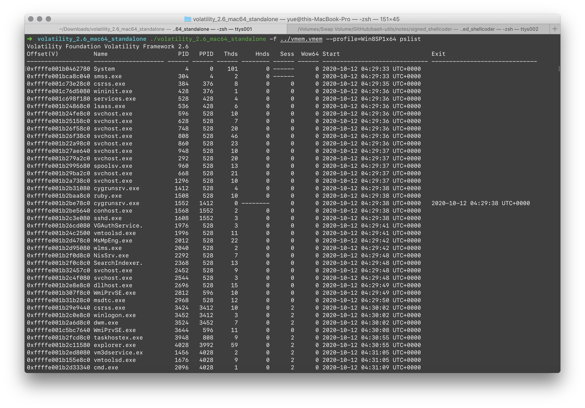
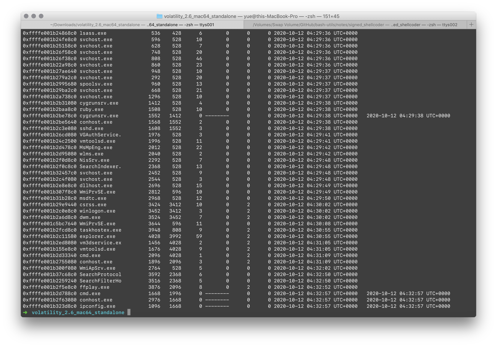
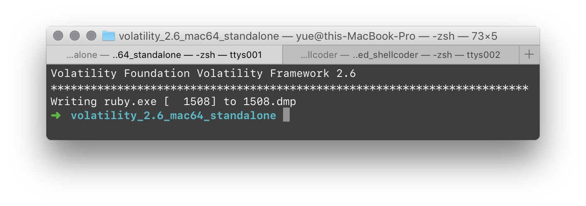
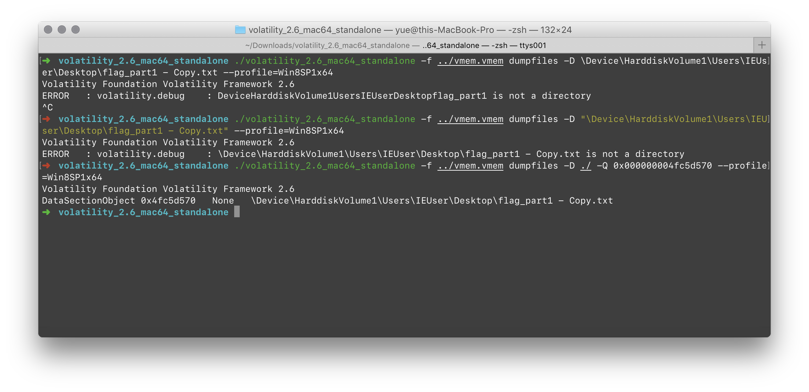
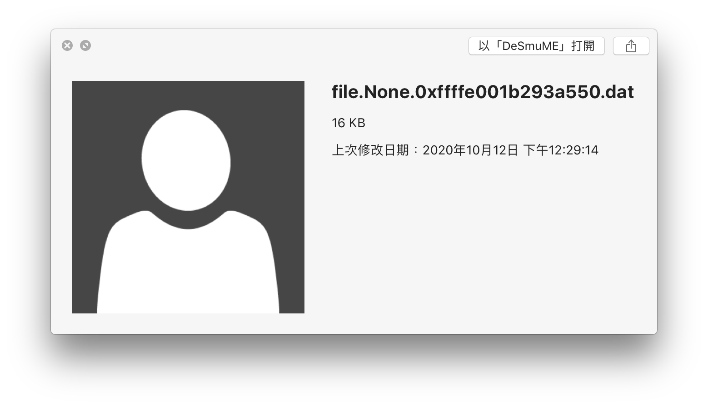
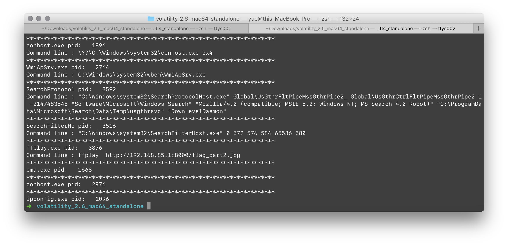
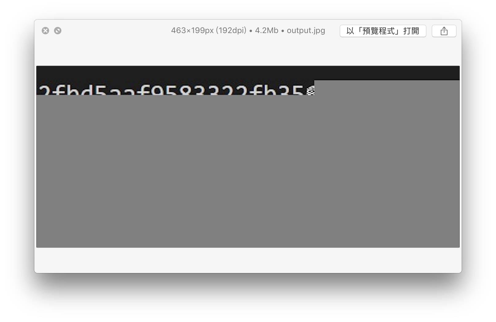

# Baby Super Easy `vmem`

又是 Baby，又是 Super Easy…

看起来是把整个内存空间 Dump 下来了

> 300 多 MiB，两个 Baby1090，淦
>
> > 解压出来 2.15 GiB，淦

这个是 VMware 虚拟机的内存 Dump 文件，Suspend VM 的时候会保留，以便快速 Resume。

> 我刚刚就 Suspend 了一个 VMware VM……

来人，上 Volatility（不



好慢啊…



结果出炉。8 世代的 Windows。而且还是昨天晚上新鲜出炉的题目。

指定 Profile 为 `Win8SP1x64`，咱们再来看看运行中的进程：





有没有什么可疑的东西？

最可疑的就是这个 `ruby.exe` 了。她肯定是在跑什么 `ruby flag.rb`。把它找出来。

> 谁没事在电脑上跑 `ruby.exe` 啊！

PID 是 1508，把他 Dump 出来：



没什么用…

把所有的文件也都 dump 出来看一下，发现一个 `flag_part1`：



可以拿到前半部分的 `flag`：

```
flag{40d24d145025012c6ae
```

还能看到他装了一个 Puppet 的 Ruby 库。

根据上面我们了解到正在运行的 Ruby 库，我们来看看有没有用户自己编写的 `.rb` 脚本：

```
0x0000000051341630     16      0 RW-r-- \Device\HarddiskVolume1\ProgramData\Microsoft\Diagnosis\events11.rbs

0x0000000051343d00     16      0 RW-r-- \Device\HarddiskVolume1\ProgramData\Microsoft\Diagnosis\events01.rbs

0x0000000051344070     16      0 RW-r-- \Device\HarddiskVolume1\ProgramData\Microsoft\Diagnosis\events10.rbs

0x00000000513456c0     16      0 RW-r-- \Device\HarddiskVolume1\ProgramData\Microsoft\Diagnosis\events00.rbs
```

包含 `.rb` 又不包含 `Puppet` 的，只有这几个乱入的 `.rbs` 了。

好吧，还是来读一读 Puppet 的文档，看看是不是有什么配置文件我们漏掉了。

把 Puppet 的一般配置文件 `puppet.conf` 打出来看看：

```ini
[main]
server=puppet
pluginsync=true
autoflush=true
environment=production
```

毛也没有。

桌面上还有个诡异的 EULA.lnk。肯定不是 ffmpeg 带的，人家 GPL 协议发布的，怎么会跟 End Users 签什么 License Agreement。

很容易看出来，这指向的是

```
C:\Windows\System32\eula.txt
```

这个文件。但是这个文件并不在所有文件列表中。

再找找图片试试？


> 找出一张默认用户头像（笑）



> 以及清晰版（笑）

还有几张 jpg：


> 这是锁屏


> 以及桌面。

这就是专供 IE 测试的 Windows 8.1 版本啦。

打印一下命令行参数，一切都清楚了。



`ffmpeg` 出现的意义就是把在服务器中的 `flag_part2.jpg ` 给显示出来。


用 `netscan` 也能看到。

显然，dump 出 ffplay 的内存应该就能得到 `flag_part2.jpg` 了。服务器就别想了，源文件肯定不在这，大概率在局域网中的另一台机器中。



显然这个没传输完整，网络连接就断掉了。

```
flag{40d24d145025012c6ae2fbd5aaf9583322fb356……
```

因为这个显然是 Ubuntu Mono 字体，因此可以靠猜写出来到这里。

最后一位实在看不清，试出来是 `a` 的…