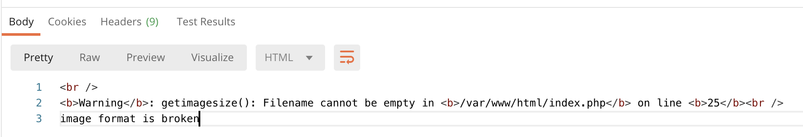
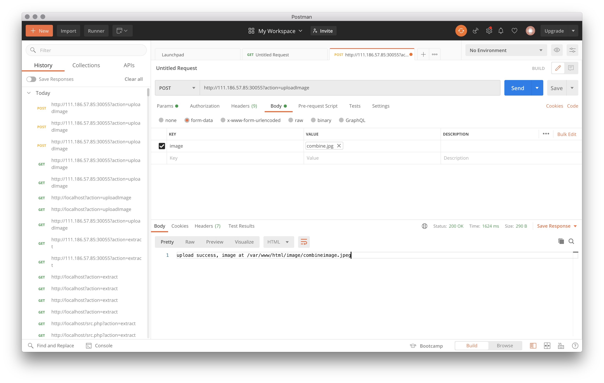
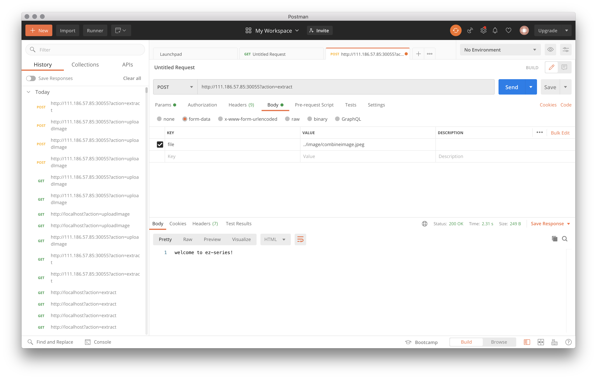

# ezupload

发送接口是 `GET http://111.186.57.85:30055?action=<ACTION>`。

可以令 `ACTION` 为 `uploadImage` 来上传一张图片；也可以用 `extract` 来解压一个压缩包，并将其中的图片做裁剪。

目标是 GetShell。

先随便上传张图试一下：

了解到的信息：

* 当前目录是 `/var/www/html`。
* 可以上传 $250 \times 250$ 尺寸的图片，不准上传 `.zip` 包。
* 传上去的图片会按照其 MIME 类型被自动重命名。
* 解压的 `zip` 会被放到 `/tmp/zip/<md5>/` 目录下。

其中，`<md5>` 是 `$SERVER["REMOTE_ADDR"] + "ezupload"` 的杂凑摘要。`$SERVER["REMOTE_ADDR"]` 的返回值应该是最后一次和服务器通信的 IP 位址。那就是我自己的 IP 位址了。

唯一的问题就是——上哪儿去找这个 `zip`。

> 当然是当作图片传上去了！

> `http://111.186.57.85:30055?action=uploadImage`

> `http://111.186.57.85:30055?action=extract`

这样，应该就能把我们传上去的 Payload 作为 `zip` 文件解压到 `/tmp/zip/...` 目录了。

> 但是最后也没找出来合法调用此目录下文件的办法…