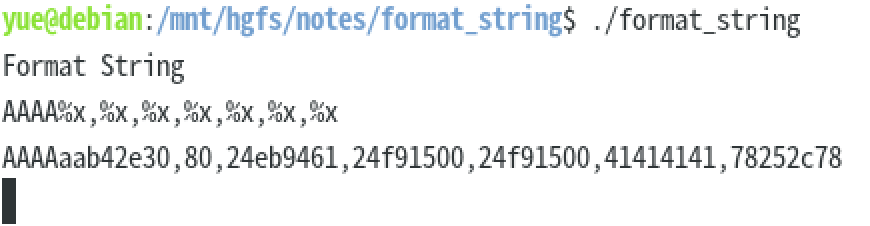
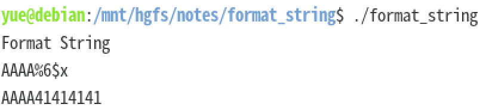
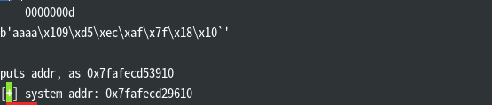

# format_string

读入一个不长于 `0x80` 的字符串，并且用

```c
int main() {
    char buf[0x80];
    printf(buf, buf);
}
```

这种怪异的方式把她打印出来。

显然，这里不存在 Buffer Overflow 的空间了（因为通过 `read` 限定了读取长度）。

但是，`printf` 的实现是不好的。存在变长参数列表，就算调用时没有给出足够的参数，只要格式化字符串中存在足够多的控制符号，就可以读取任意多的内容——连六个寄存器带栈。

看起来到这里都没什么问题——只是任意读，好像也不能做什么。但是，格式化字符串 `%n` 可以将目前已经写出的字符的个数给到对应的指针位置上。如果精心构造，完全可以实现任意数据的写入。



漏出字符串初始地址（`41414141`）。不断地写 `%`，就能迫使 `printf` 无限地往栈上读，最终实现任意地址的读取。



> 尝试得出参数偏移量



> 拿到 `puts` 的真实地址，从而算出 `system` 的地址。

注意 x64 下，地址位一般会带有大量的前导零。`read` 不管 `\0`，但是 `printf` 遇到 `\0` 就罢工了。因此必须将要写入的地址后置（至少要在控制字符後面），并且将前面的控制字符按照 8 字节对齐。

用 `gdb` 测试可以确认输出值的正确性。

下面我们要改写 Payload 了。

> `fmtstr_payload` 生成的老是有点问题。自己写好了。

容易看得出来，`puts_addr` 和 `system_addr` 的区别，只有三个字节。因此只要改动他们就好了。

用 `%c` 打印指定个数的字符，然后用 `%n` 漏洞写入就好了。

Ref 2 中说为了保证有序，排列字节的做法其实不必要。

可以通过动态改换写入指针的地址，或者利用 `char` 256 溢出的特性就能自由写入任何字节了。

> 本地跑会莫名其妙地偏 `0x2c50` 个字节。远程不需要这样 Hack 的。

> 其实这个算是入门题的…
>
> > 好高的门槛
> >
> > > 幸好我只是来玩的

## Refs

* https://veritas501.space/2017/04/28/格式化字符串漏洞学习/
* https://www.anquanke.com/post/id/194458