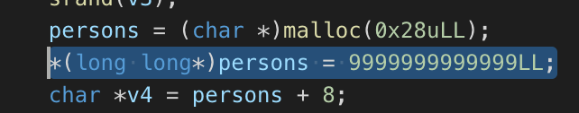

# game

开局一个 Binary。

> 光速召唤曼特农夫人



> 一看这就不是什么正经人写的

一大堆的初始化实际上可以看成是 `struct` 的初始化。

IDA Pro 7.0 分析 `switch` 好像还是差点意思，老是给弄成 `while`。

简单看，就是一个文字冒险游戏的套路：

```c
#include <stdint.h>
#include <stdio.h>

struct Person {
    int64_t power;
    char name[0x20];
}

struct Person** persons;

int main(int argc, const char** argv, const char** envp)
{
    setbuf(stdout, 0LL);

    srand(time(NULL));

    persons[0] = (struct Person *)malloc(40);

    persons[0].power = 9999999999999LL;
    
    strncpy(persons[0].name, "BOSS", 4);

    int flag; // [rsp+Ch] [rbp-4h]
    while (1) {
        switch (flag)
        {
        case 1:
            add();
            break;
        case 2:
            fight();
            break;
        }
    }
    return 0;
}
```

这里构造了一个叫做 `BOSS` 的人物，血量竟然设定成了超级高的一个数。

给了一些初始条件，就开始要求输入了。

> 这里有 `note` 同款 `read_int` 哦
>
> > 还有同款负数溢出漏洞哦

一个是 `add`：

```c
size_t add()
{
    if ( hero_counter > 5 )
    {
        puts("Person are full! Restart the game.");
        for ( int i = 5; i >= 0; --i )
            free((void *)persons[i]);
        hero_counter = 1;
    }

    persons[hero_counter] = (struct Person *)malloc(0x28);
    persons[hero_counter].power = rand() % 10000000;
    puts("Give your hero a name!");
    int ret = read(0, persons[hero_counter].name, 0x20);
    ++hero_counter;
    return ret;
}
```

显然，这个就是构造了一个新角色人物。而且，将其初始状态下的 Life 设定为了 0 ~ 9999999 下的随机数。

况且，最多只能添加 5 个英雄。考虑到 `hero_counter` 这里用户完全无法输入，因此不检查 `<=0` 也算合理。

```c
int fight()
{
    puts("Choose your hero");
    int index = read_int();
    if ( index <= 0 || index > 5 )
        return puts("No no no.");
    if ( persons[0].life >= persons[index].life || strcmp(persons[0].name, "BOSS") )
        return puts("Your hero failed our expect.");
    puts("How did you achieve this?! You are our true hero!\nEnjoy your fruit!");
    return system("/bin/sh");
}
```

Fight 嘛…这个问题就很大了。

选一个英雄出战，要求其血量比 BOSS 高。

同时，她还贴心地帮我们检查了对手是否是真·BOSS。

显然，正常打肯定是打不过的——不可能生成一个血量比那位大爷还高的 Hero。

缓冲区溢出有吗？似乎没有，因为这里并没有 `note` 那样的任意读写漏洞（`hero_counter` 是程序计算、保存的）。也不存在缓冲区溢出，`name` 的读取不存在问题。

唯一一个看起来可能有问题的就是他用了 `malloc` 来分配内存却没有清空；或许其中还残留着一个有效的指针；又或许这个指针刚好指向一个很大的数。

实际上，这样的值并不是特别难找。别看这个 BOSS 血量高，实际上表示在 64 位就是


而已。如果能找到一个指向内存地址的指针，那么还是很有可能打败 Boss 的。

除此之外，还存在另一个问题：`struct Person` 中留给 `name` 的长度就 `0x20` 个字节，他却真的去用 `read` 读了 `0x20` 个。

换言之，没有给 `\0` 留空间。可以泄漏出堆的地址。

