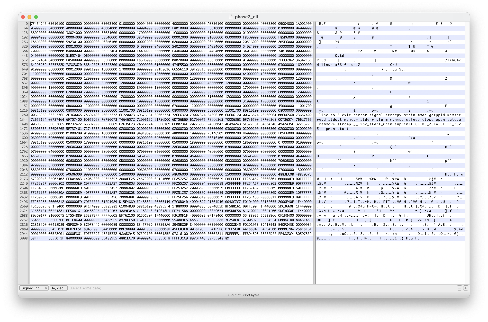

# GEA

## Level 0

#### 

不可能那么简单，估计是连环问…

第一问没什么办法。可能存在的字符一共有 $10 + 26 \times 2 = 62$ 个，因此所有的可能性是 $62^4 = 14776336$ 种。

遍历一下好了。

## Level 1

第一问之後，过了一段时间（大概几秒钟）才传来第二个问题。

或许是什么很费时间的操作吧。

然後，得到了一堆看起来就像是 Base64 编码的东西。

丢进 `base64` 库一转，发现这么个东西：

ELF 嘛。

似乎每一次发过来的可执行文件都还不一样——似乎是现场编译的。

> 延迟也就可以解释了。

> Ida！Ida！

最後得到的是一个 100 KiB 的可执行文件。