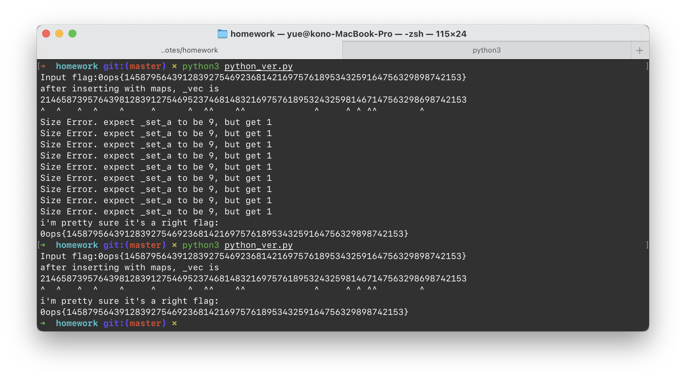

# homework

C++ 编译出来的代码，不带 `.pdb` 简直没法看嘛。

> 带了 `pdb` 也不是很好看…

先把 IDA 吐出来的东西用我蹩脚的 C++ 重写一遍。

写的时候满脑子都是 `std::std::std::std::`。所以写完啥也不记得了。

只好又用 Python 二次移植……写到後头才发现。

除去 `flag` 的标准头尾，要求输入 64 个数字。

预先给出的 `std::set<std::pair<int, int>>`，有 17 组。

这些组会被插入到 `std::vector` 中，一共 81 个数字。

然后从其中（用某种手段）构造了 27 个 `std::set`，每个的大小都得是 9。这不就是数独吗？

刚好，给出 17 个位置，数独的解就唯一了。

这样题目描述就说得通了：练习 C++，编程写数独。

> 李显龙再世（不

随便找了个网页解出来就行了。

> Python 大法好