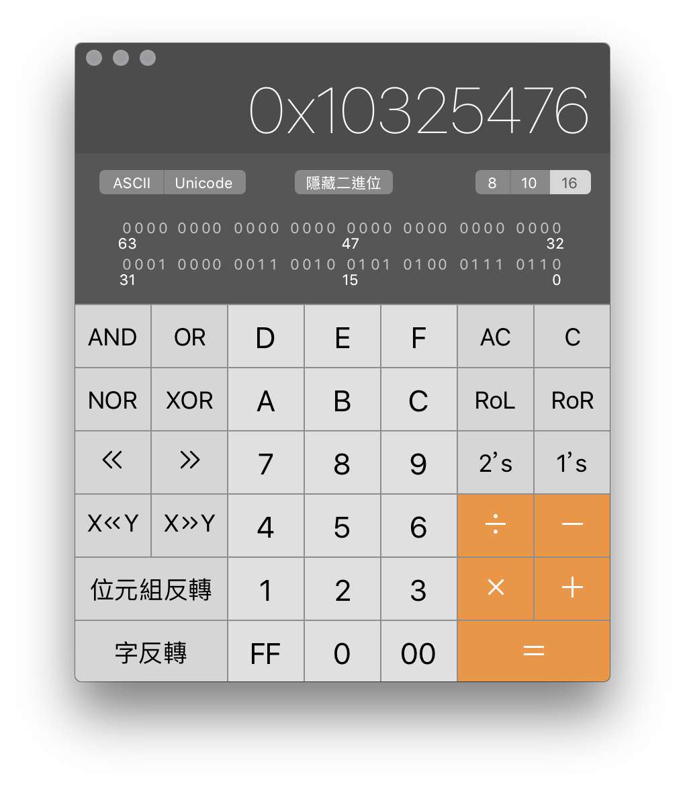
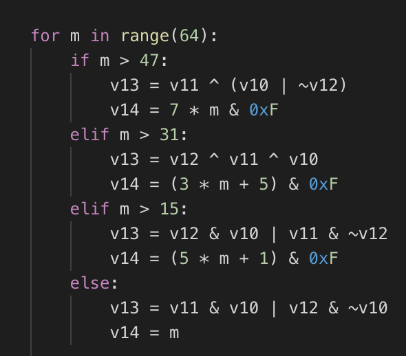
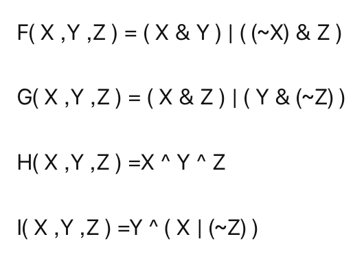
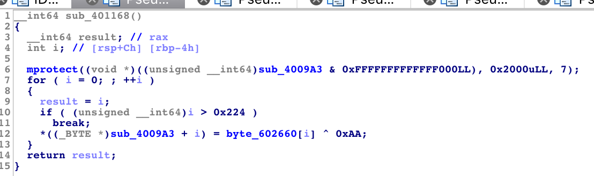
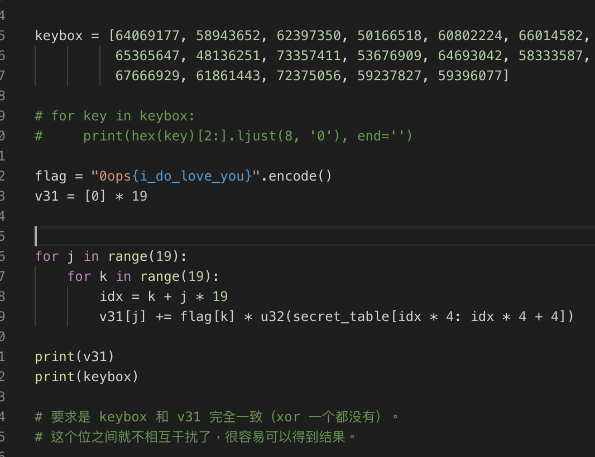
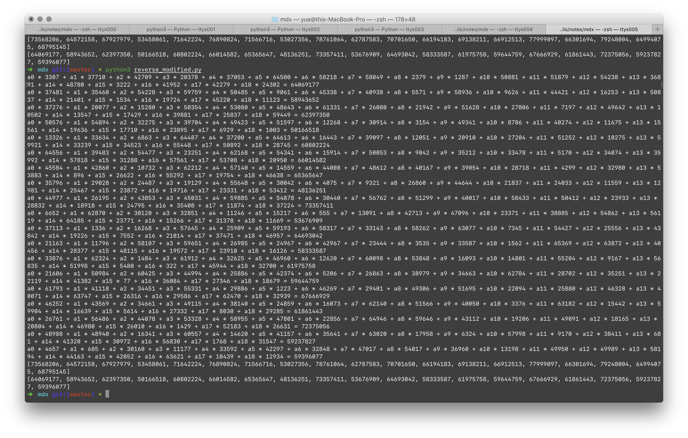
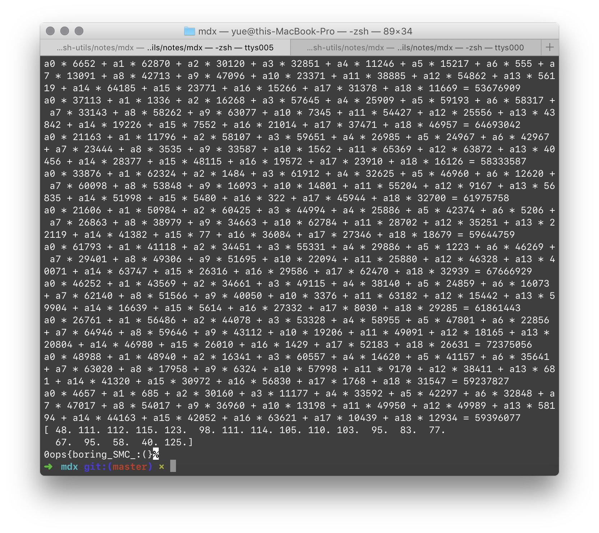

# mdx

`main` 函数惊人简单。

```c
int main(int a1, char **a2, char **a3)
{
    char s[64];

    alarm(60);
    memset(s, 0, 50);
    puts("Your flag:");
    read(0, s, 19);

    if ( strlen(s) == 19 && !sub_4009A3(s) )
        puts("Right!");
    else
        puts("Wrong~");
    return 0LL;
}
```

只要输入一个 19 位长度的字符串，并且通过 `sub_4009A3(s)` 返回 `False` 即可。

除去 `0ops{` 和 `}`，其实可变的就只有 13 个而已。

```python
    for m in range(64):
        if m > 47:
            v13 = v11 ^ (v10 | ~v12)
            v14 = 7 * m & 0xF
        elif m > 31:
            v13 = v12 ^ v11 ^ v10
            v14 = (3 * m + 5) & 0xF
        elif m > 15:
            v13 = v12 & v10 | v11 & ~v12
            v14 = (5 * m + 1) & 0xF
        else:
            v13 = v11 & v10 | v12 & ~v10
            v14 = m

        v1 = v12
        v12 = v11
        v11 = v10
        v10 += (v9 + v13 + keybox_1[m] + nums[v14]) << keybox_2[m]
        v9 = v1
```

初始值给的是：

```python
v9 = 0x67452301
v10 = 0xEFCDAB89
v11 = 0x98BADCFE
v12 = 0x10325476
```




这四个魔术数字刚好就是 MD 系列杂凑算法用的吧。

另外，因为 16 次一轮的算法这里进行了 4 次，所以应该是 MD5 的变种吧。





看起来就是标准的 MD5 杂凑算法。但是，未知位有 13 位，这根本不可能暴力破解嘛。

但是…但是！我们可以看到这样的代码：



`sub_4009A3` 的代码在运行时被更改了！

自己做一下异或，IDA 一下解密代码，可以得到一个新程序：

```c
__int64 __fastcall sub_4009A3(__int64 a1)
{
  int *v1; // rdi
  unsigned __int64 v2; // rdx
  __int64 result; // rax
  __int64 v4; // rsi
  unsigned __int64 v5; // rt1
  __int64 v6; // [rsp+8h] [rbp-D8h]
  signed int i; // [rsp+1Ch] [rbp-C4h]
  signed int j; // [rsp+20h] [rbp-C0h]
  signed int k; // [rsp+24h] [rbp-BCh]
  unsigned int v10; // [rsp+28h] [rbp-B8h]
  signed int l; // [rsp+2Ch] [rbp-B4h]
  int v12; // [rsp+30h] [rbp-B0h]
  int v13; // [rsp+34h] [rbp-ACh]
  int v14; // [rsp+38h] [rbp-A8h]
  int v15; // [rsp+3Ch] [rbp-A4h]
  int v16; // [rsp+40h] [rbp-A0h]
  int v17; // [rsp+44h] [rbp-9Ch]
  int v18; // [rsp+48h] [rbp-98h]
  int v19; // [rsp+4Ch] [rbp-94h]
  int v20; // [rsp+50h] [rbp-90h]
  int v21; // [rsp+54h] [rbp-8Ch]
  int v22; // [rsp+58h] [rbp-88h]
  int v23; // [rsp+5Ch] [rbp-84h]
  int v24; // [rsp+60h] [rbp-80h]
  int v25; // [rsp+64h] [rbp-7Ch]
  int v26; // [rsp+68h] [rbp-78h]
  int v27; // [rsp+6Ch] [rbp-74h]
  int v28; // [rsp+70h] [rbp-70h]
  int v29; // [rsp+74h] [rbp-6Ch]
  int v30; // [rsp+78h] [rbp-68h]
  int v31[22]; // [rsp+80h] [rbp-60h]
  int _C8[22]; // [rsp+C8h] [rbp-18h]
  unsigned __int64 v33; // [rsp+D8h] [rbp-8h]

  v6 = a1;
  v33 = __readfsqword(0x28u);
  v12 = 64069177;
  v13 = 58943652;
  v14 = 62397350;
  v15 = 50166518;
  v16 = 60802224;
  v17 = 66014582;
  v18 = 65365647;
  v19 = 48136251;
  v20 = 73357411;
  v21 = 53676909;
  v22 = 64693042;
  v23 = 58333587;
  v24 = 61975758;
  v25 = 59644759;
  v26 = 67666929;
  v27 = 61861443;
  v28 = 72375056;
  v29 = 59237827;
  v30 = 59396077;
  memset(v31, 0, 0x48uLL);
  v1 = _C8;
  _C8[0] = 0;
  v2 = (unsigned __int64)&_C8[1];
  for ( i = 0; i <= 18; ++i )
    v31[i] = 0;
  for ( j = 0; j <= 18; ++j )
  {
    for ( k = 0; k <= 18; ++k )
    {
      v1 = (int *)k;
      v2 = (unsigned int)(v31[j] + *(char *)(k + v6) * dword_6020A0[k + 19LL * j]);
      v31[j] = v2;
    }
  }
  v10 = 0;
  for ( l = 0; l <= 18; ++l )
  {
    v2 = (unsigned int)*(&v12 + l);
    v10 += v2 ^ v31[l];
  }
  result = v10;
  v5 = __readfsqword(0x28u);
  v4 = v5 ^ v33;
  if ( v5 != v33 )
    result = (*(__int64 (__fastcall **)(int *, __int64, unsigned __int64))((char *)&stru_4002F8.st_size + 2))(
               v1,
               v4,
               v2);
  return result;
}
```

写成 Python 大概长这样：



可以看到，`v31` 的每一位都是由总共 19 个 `char`，加上 `secret_table` 解出来的。

换句话说，这就是一个十九元一次方程。

表示成系数矩阵，就是：



使用 `numpy` 的 `linalg` 解方程组，可以得到：



> 注意坑货 `linalg` 返回的是浮点数（精度貌似还不是很高），直接 `int()` 的话，有些 char 就会漂移一位 ASCII……