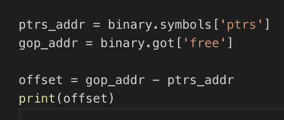
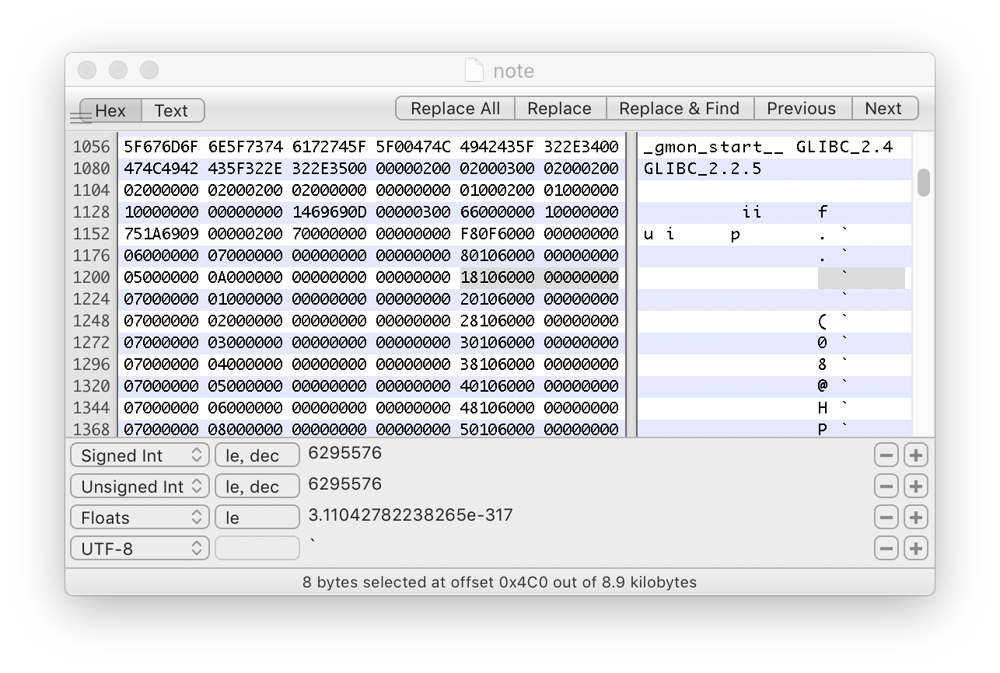
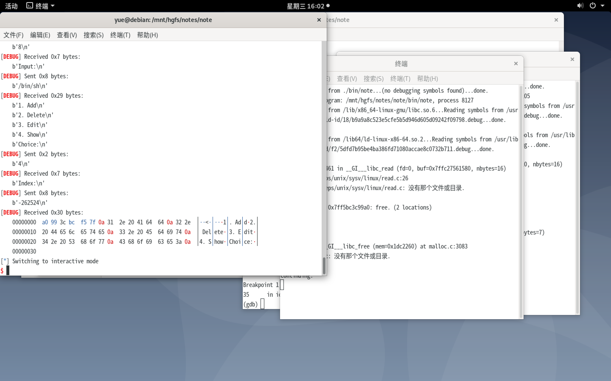

# note

旧学院派的 Heap 攻击…

```c
#include <stdio.h>

int main(int argc, const char **argv, const char **envp)
{
	int flag;

	setbuf(stdout, 0LL);
	puts("Start our heap journey from old-school style!");
	puts("How many ways can you exploit this?");
	while ( 1 )
	{
		flag = read_int();
		switch (flag)
		{
		case 1:
			add();
			break;
		case 2:
			delete();
			break;
		case 3:
			edit();
			break;
		case 4:
			show();
			break;
		default:
			puts("Invalid");
			break;
		}
	}
}
```

这里看起来我们能干预的就一个 `read_int`。实现也是相当人畜无害：

```c
int read_int()
{
    char buf[0x20]; // [rsp+0h] [rbp-20h]
    read(0, &buf, 0x10uLL);
    return atoi(buf);
}
```

`atoi` 好像没听说过什么任意写的漏洞。咱们往下看。

通过维护一个全局固定大小的 `char *` 数组：

```c
char *ptrs[16];
```

实现了增删改查：

```c
int add()
{
    puts("Index:");
    int index = read_int();
    puts("Size:");
    int size = read_int();
    char *buf = (char *)malloc(size);
    result = index;
    ptrs[index] = buf;
    return result;
}
```

```c
void delete()
{
    puts("Index:");
    int index = read_int();
    free(ptrs[index]);
}
```

```c
size_t edit()
{
    puts("Index:");
    int index = read_int();
    puts("Len:");
    int len = read_int();
    puts("Input:");
    return read(0, ptrs[index], len);
}
```

```c
int show()
{
    puts("Index:");
    int index = read_int();
    return puts(ptrs[index]);
}
```

所有**对于条目**的读写增改都由指向的字符串实现，并且所有的输入都做好了「长度限制」。

然而，`edit` 却没有对 `index` 的范围、有效性做任何检查。我可以随意输入一个超大的数字来在任何位置读取。

题目顺带给出了使用的 `libc`。这样，只要任意泄露出一个符号的地址，就可以改写 GOT，实现任意跳转。

这里提前 `create` 一个内容为 `/bin//sh` 的 Note Entry，把 `free` 的 GOT 改写为 `system` 的，然后随意调一次 `delete()` 就解决了。

唯一的问题就是该怎么覆写 GOT 了。

可以看到这个可执行文件的安全保护：

```c
yue@debian:/mnt/hgfs/notes/note/bin$ checksec note
[*] '/mnt/hgfs/notes/note/bin/note'
    Arch:     amd64-64-little
    RELRO:    Partial RELRO
    Stack:    Canary found
    NX:       NX enabled
    PIE:      No PIE (0x400000)
```

没有开启 PIE。但是开启了（部分）RELRO。那么我们该怎么实现任意的读取呢？

通过传入不合理的索引，我们可以读到任何位置的内存「作为指针」指向的内存位置。

> 稍微有点绕…

`show` 和 `edit` 中都存在 `ptrs[index]` 的用法；所以只要传入略带恶意的 `index`，就可以实现了。



简单操作，发现每次运行 offset 都不会改变的。

那么我们就试试用 `show` 功能来读 GOT 吧！

但是，这里并不是一个简单的 `*(p)` 构造。即，她不是直接返回指针处的值，而是根据偏移量找到一个指针，读取该指针指向的字符串，遇 `\0` 停止。

> 多套了一层。

所以，如果我们直接把 `got_addr` 和 `ptrs_addr` 的差值除以 8（典型的 64 位指针）传给 `show`，结果就是把 GOT 条目当作指针读取。这就失败了。

能不能在输入的 String 中构造出指针位置，然後通过 Heap 做间接跳转呢？这也不行。打开 GDB 捣鼓一下就能发现每次分配的地址都是不确定的。而且，也不存在在运行时泄露堆地址的方法。

搜索一下 ELF 文件，可以发现其中正好有一段包含目标 GOT 地址的字节流。而且，正好是 8 字节对齐的。

已经可以了。



首先，调用一次 `create - free` 来确保 GOT 表填充好。

然后，随便添加一条 Note，把 `/bin//sh` 放进去。

然后，构造 Index 来让指针读取跑偏到这个魔法位置。

成功拿到基址。



然后要做的事情就跟 `format_string` 一样了。比那还要简单——怎么读的怎么写。

最后，假装让 `delete()` 去 `free` 那条 `/bin//sh`，实际上她不知道 `free` 的 GOT 条目已经被我们偷换成 `system` 了。哈哈哈哈。

大功告成。

> 注意不要滥用 `sendline`。比如在这里服务程序使用 `read(0, buf, BYTES_TO_READ)` 来读取时，如果用了 `sendline` 就会导致多发一个垃圾字符 `\n`，对後面的数据输入产生影响。

> 好习惯：记得用 Pwntools 的时候，一定要用明确指出结束符的 `recvline` 或者 `recvuntil`。
>
> 否则，就容易在本地跑通，在服务器上跑不过的问题（这八成是因为网络延迟，导致接收到的字节和本地不一致了）。

## 跋

> H0w m4ny vul3rab1l1t1es h4ve u f0und?

漏洞不止一个。

我找到的这大概是最基础的了。

而且也是最好修复的——限制 Index 的范围、记录已分配的 Index 序列、在 `free` 之前做个检查、把魔术代码从 ELF 中删掉——随便怎么操作一下，我这一套都行不通了。