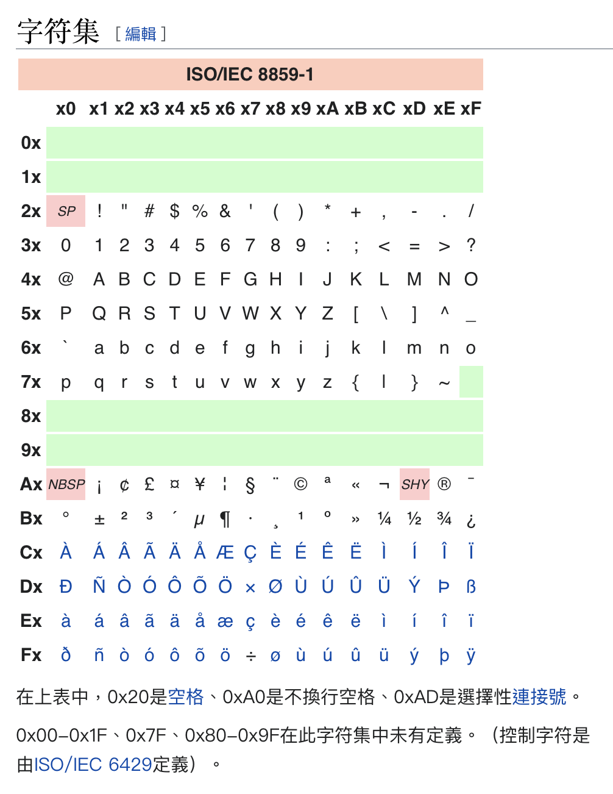

# Shellcode · 3

输入的 Shellcode 要满足这些条件：

* 必须在 `latin1` 字符集中。

> ISO/IEC 8859-1 的别名。



总归，落在有色区段中的字符都不可以用。

* 按照空格（`0x20`）拆分後的单词长度不超过 10000。

> 大概也写不了那么长。

* 每个字符刨去两端的 `.,?-![]` 并转化成小写之後，必须落在 Return of Jedi 的歌词中。

```python
{b'', b'please', b'control', b'perimeter', b"leia's", b'groups', b'defenses', b'either', b'now...come', b'readily', b'almighty', b'alright', b'unarmed', b'report', b'machine', b'failure', b'changed', b'careful', b'assume', b'hide', b'scanners', b'chewie', b"somebody's", b"somehow...i've", b'yet', b'real', b'hutt', b"isn't", b'beast', b'allowed', b'her', b'with', b'life', b'primitive', b'cannot', b'using', b'could', b'transpired', b'angry', b'require', b'stick', b'wise', b'unfortunate', b'furry', b'out', b'anyone', b"artoo's", b'wrecked', b'see-threepio', b'stop', b'craft', b'their', b'how', b'knew', b'skills', b'trouble', b'now', b'countdown', b'about', b'say', b'beautiful', b'impersonate', b'so', b'weapon', b'remains', b'sum', b'get', b'strongly', b'detonator', b'generator', b'witness', b'awaits', b'swelling', b'mother', b'thermal', b'that', b'same', b'victims', b'dead', b'screen', b'quietly', b'only', b'lot', b'introduce', b'man', b'all-powerful', b'boba', b'general', b'offers', b'meet', b'further', b'compassion', b'matter', b'undoing', b'first', b'better', b'decoration', b'doing', b'quiet-like', b'error', b'closer', b'construction', b'shall', b'sensors', b"vader's", b'triple', b'group', b'sea', b'onto', b'anything', b'already', b'or', b'above', b'home', b'degrees', b'nice', b'means', b'go', b'thoughts', b'approach', b'nesting', b"there's", b'sounds', b'highness', b'second', b'companion', b'woods', b'quickest', b"star's", b'while', b'become', b'chamber', b'guard', b'was', b'fast', b'sail', b'else', b'feeling', b'fearless', b'special', b'fault', b'strike', b'will', b'excellency', b'charge', b'wisdom', b"haven't", b'bring', b'allow', b'team', b'should', b'mistaken', b'profit', b'princess', b'transmit', b'shield', b'tell', b'animal', b'source', b'towards', b'gift:', b'security', b'failed', b'sometime', b'miss', b'operational', b'brought', b'energy', b'open', b'wrong', b'completed', b'another', b'hold', b'betray', b'believe', b'companions', b"wasn't", b'penetrated', b'rebels', b'concentrate', b'run', b'send', b"she's", b'carbonite', b'systems', b'she', b'sector', b'fighters', b'confront', b'inform', b'battle', b'station', b'this', b'him', b'constructed', b'strong', b"don't", b'goes', b'yes...i', b'space', b'communication', b'nicely', b'equally', b'hunter', b'betrayed', b'languages', b'surprised', b'said', b'gladly', b'weak-minded', b'carry', b'madine', b'try', b'bothans', b'bad', b'all:', b'lando', b'appears', b'alongside', b'delusions', b'shhh', b'smuggler', b'guards', b'sarlacc:', b'truth', b'asks', b'oh', b'ship', b'blue', b'enjoy', b'mechanism', b"party'll", b'unhappiness', b'programming', b'assembled', b'she-she', b'into', b'getting', b'were', b"shouldn't", b'furball', b'fleeing', b'forms', b'lower', b"ain't", b'aggression', b'shuttle', b'trace', b"bunker's", b'knock', b'jamming', b'serve', b'instruct', b'suppose', b'pitiful', b'influence', b'kid', b'bids', b'fair', b'saying', b'path', b'splendid', b'to', b'after', b'where', b'dead...and', b'there', b'ridge', b'fool', b'far', b'casual', b'hands', b'dispense', b'last', b'use', b'way', b'price', b'a...jedi', b'thanks', b'return', b'reports', b'near', b'captured', b'tydirium', b'gonna', b"i've", b'yoda', b'hi', b'twin', b'knight', b'mission', b'idea', b'had', b'mighty', b'yours', b'want', b'gift', b'relax', b'lightsaber', b'sense', b'critical', b'powerful', b'dialect', b'impossible', b'comes', b'around', b'hardly', b'these', b'rebellion', b'escape', b'surprise', b'favorite', b'repel', b'goodness', b'end', b'range', b'medical', b'lost', b'something', b'decided', b"he'll", b'die', b'patience', b'shot', b'feeble', b'stomach', b"jabba's", b'time', b'father', b'suggest', b'strange', b'come', b'eat', b'bargained', b"it'll", b'resist', b'alone', b'thought', b'reactor', b'frigate', b'green', b"code's", b'forest', b'crossbow', b'but', b"you've", b'bunker', b'mmm', b'gold', b'think', b'word', b'ahhhhhh', b'paid', b'listen', b'but...sad', b'vision', b'nature', b'proceeding', b'okay', b'everything', b'less', b'force', b'technical', b'deep', b'evil', b"what's", b'execute', b'distance', b'remains:', b'a', b'troops', b'imagination', b'feel', b'of', b'someone', b'deity', b'convert', b'up', b'weak', b'cover', b'mean', b'designed', b'cargo', b'still', b'obey', b'know', b'beg', b'pinpoints', b'bridge', b'accelerate', b'passing', b'crew', b'maybe', b'turn...and', b'luke;', b'legion', b'trap', b'therefore', b'armed', b'guarded', b'sickness', b'hear', b'orbiting', b'i--i', b'effort', b'gun', b'mark', b'pull', b'base', b'weapons', b'forced', b'fall', b'firepower', b'important', b'bury', b'jedi', b'each', b'especially', b'super', b'correct', b'does', b'some', b'forgiving', b'commander', b'turn', b'sister', b'beneficial', b'draw', b'close', b'looking', b'planned', b'sound', b'those', b'defense', b'i', b'owe', b'because...there', b'mind', b'god', b'are', b'attack', b'hope', b'enemy', b'bounty', b'pilot', b'walking', b'murdered', b'trick', b'really', b'st', b'strength', b'conduct', b'once', b'throughout', b'learn', b'million', b'mv-7', b'artoo', b'driven', b'few', b'course', b'count', b'underestimate', b'wookiees', b'beware', b'rise', b'wha', b'fight', b'piece', b'big', b'it', b'decreed', b'attempted', b"i'm", b"won't", b'must', b'expressed', b'squads', b'safely', b'master', b'ohhh', b'runs', b'cling', b'light', b'part', b'says', b'disintegrated', b'threepio', b'fodder', b"they'd", b'quickly', b'all', b'back', b'worth', b'hmm', b'ready', b'enable', b'never', b'also', b'han', b'reinforcements', b'find', b'kill', b'probably', b'we', b'unprotected', b'search', b'dro-o-op', b'taking', b'spies', b'tower', b"emperor's", b'death', b'clearance', b'deactivate', b'truths', b'if', b'refer', b'checks', b'apprentice', b'fresh', b'morning', b'aggressive', b'moment', b'such', b'fighter', b'generated', b'until', b'himself', b'short', b'immediately', b'definition', b'wa-wait', b'ask', b'separated', b'imminent', b'forward', b'things', b'waits', b"master's", b'transmission', b'young', b'me', b'together', b'waiting', b'filth', b'bantha', b'then', b'more', b'junk', b'longer', b'share', b'agrees', b'motivate', b'perhaps', b'yeah', b'easy', b'twisted', b'luke', b'coordinates', b'system', b'unavoidable', b'huh', b'imperial', b'figure', b"'em", b"we've", b'mine', b'older', b'squad', b'holding', b'calrissian', b'forever', b'foreseen', b'code', b'see', b'heard', b'deactivation', b'kind', b'dangerous', b'lead', b'sir', b'destroy', b'goodwill', b'respect', b'twenty', b'though', b'leave', b'digested', b'troubling', b'worried', b'attacking', b'fluent', b'as', b'able', b'relatively', b'maneuver', b'rush', b'coming', b'burden', b'ya', b'problem', b'pleas', b'honorably', b'landed', b'rushed', b'became', b'regulator', b'incomplete', b'wish', b'presence', b"here's", b'save', b'uh', b'pain', b'gravely', b'sort', b'intensify', b'spread', b'side', b'within', b'attempt', b'sky...sky...walker', b'them', b'lord', b'eyesight', b'hat', b'told', b'offensive', b'assure', b"comin'", b'hibernation', b'platform', b'came', b'luck', b'for', b'felt', b'await', b'honored', b'what', b'outrage', b'rewarded', b'respectable', b"didn't", b'honor', b'batteries', b'hidden', b'even', b'loves', b'reading', b'stolen', b'rough', b'happened', b'rebel', b'gone', b'human-cy', b'request', b'view', b'vader', b'arrive', b"we're", b'captain', b'point-blank', b'yes', b'pirate', b'sit', b'overconfidence', b'hello', b'lock', b'double', b'sleep', b'greatness', b'0300', b'credit', b'show', b'feelings', b"it's", b'used', b'gently', b'put', b'mask', b'true', b'fate', b'safe', b'welcome', b'progress', b'working', b'commencing', b'name', b'many', b'bargain', b'best', b'the', b"where's", b'an', b'rash', b'hardworking', b"team's", b'tie', b'copy', b'obi-wan', b'very', b'interpreter', b"jedi's", b"goin'", b'thirty-five', b'remember', b'rather', b"we'll", b'bear', b'land', b'unwise', b'pleasure', b'training', b'illustrious', b'looks', b'unexpected', b'ride', b'here', b'twilight', b'call', b'survive', b'speed', b'alarm', b'left', b'personally', b'let', b'entire', b'massing', b'deflector', b'dark', b'information', b'carkoon', b'pursuit', b'complete', b'accepted', b'hang', b'heading', b'confidence', b'greatly', b'been', b'takes', b'funny', b'serving', b'drinks', b'saw', b"let's", b'stubborn', b'form', b'again', b'nah', b'blur', b'without', b"can't", b'everybody', b'head', b'gotta', b'main', b'moon', b'our', b'evasive', b'magic', b'watching', b'freeze', b'fear', b'set', b'friend', b'standing', b"oh...i'm", b'wonderful', b'charges', b"hasn't", b'optimistic', b'too', b'wonder', b'efforts', b'insignificant', b'switch', b"father's", b"that's", b'blow', b'on', b'remain', b'anger', b'throw', b'his', b'pay', b'somebody', b'destruction', b'truly', b'outta', b'has', b'look', b'pal', b'sanctuary', b"you'll", b'grab', b'divine', b'understand', b'protect', b'skywalker', b'awake', b'indeed', b'did', b'six', b'brother', b'right', b'instructions', b'and', b'at', b'turned', b'wait', b'little', b'talk', b'myself', b'darth', b'disguised', b'thy', b'spoke', b'anybody', b'forgotten', b'"hello"', b'upon', b'flow', b'need', b"i--i'm", b'just', b'hmmm', b'acquisitions', b'worshipfulness', b'dominate', b'earned', b'bidding', b'servant', b'location', b'star', b'jabba', b'design', b'died', b'belly', b'wanted', b'stand', b'can', b'fit', b'deactivated', b'feisty', b'leader', b'surrender', b'wookiee', b'audience', b'deck', b'situation', b'"exciting"', b'endangering', b'take', b'fett', b'frozen', b'landing', b'permission', b'sure', b'memory', b'now...go', b'speak', b"he's", b'gray', b'small', b'asking', b'engage', b'hotwire', b'like', b'depend', b'not', b'power', b'three', b'suffer', b'insight', b'brave', b'orders', b'slipping', b'reach', b'night', b'may', b'than', b'secret', b'blind', b'faith', b'have', b'embarrassed', b'because', b'defenseless', b'vain', b'over', b'red', b'area', b'jittery', b'quite', b'worm-ridden', b'appraisal', b'forget', b'ben', b'nearby', b'convenient', b'droid', b'supplies', b'pretty', b'dune', b'why', b'playing', b'love', b'certain', b'seek', b"thing's", b'band', b'follow', b'nine', b'any', b'token', b'watch', b'droids', b'scheudule', b'instead', b'ackbar', b'start', b'reason', b'from', b'poor', b'old', b'buddy', b'warmed', b'arrives.e', b'06', b'sick', b'mutually', b'do', b'emperor', b'sake', b'restraining', b'displeased', b'give', b'ways', b'boy', b'threat', b'before', b'cast', b'somehow', b'doomed', b'alliance', b'message', b'hyperspace', b'accounted', b'born', b'wedge', b'away', b'taken', b'ships', b'would', b"doesn't", b'took', b'hurry', b'fly', b'arrived', b"i'll", b'most', b'chewbacca', b'crazy', b'create', b'point', b'heavily', b'be', b'greetings', b'protocol', b'sullust', b'slowly', b'jump', b'grown', b'unpleasant', b'other', b'match', b'admiral', b'leia', b'family', b'prepare', b'speeders', b'deal', b'north', b'both', b'pit', b'exalted', b"wouldn't", b'when', b'am', b'solo', b'ah', b'make', b'trying', b'split', b'afraid', b"solo's", b"excellency's", b'suffering', b'meaning', b'higher', b'completing', b"this'll", b"couldn't", b'almost', b'thinking', b'move', b'known', b'done', b'321', b'wings', b'just...images', b'long', b'learned', b'proper', b'in', b'terminal', b'banquet', b'worry', b'who', b'fire', b'serves', b'apparent', b'yourself', b'thousand', b'us', b'fine', b'men', b'47', b'good', b'stuck', b'volunteered', b'fully', b'sarlacc', b"lookin'", b'identify', b'conflict', b'galaxy', b"aren't", b'surrendered', b'jam', b'someplace', b'scouts', b'half', b'two', b'heroics', b'pardon', b'choice', b'eyes', b'new', b'although', b'palace', b'found', b'according', b'escaping', b'high', b'fleet', b'bit', b'exact', b'break', b'but--but', b'help', b'well', b'no', b'fastest', b'parts', b'quick', b'surface', b'protected', b'bothan', b'passage', b'care', b'your', b'fortune', b'thing', b'dear', b'scum', b'commence', b'keep', b'sidetracked', b'proceed', b'overseeing', b'promise', b'rescue', b'it...and', b'through', b'empire', b"you're", b'since', b"they'll", b'entrance', b"we'd", b'ceased', b'great', b'position', b'action', b'mercy', b'inventive', b'sister...you', b'anonymous', b'off', b'won', b'destroyer', b'nevertheless', b"luke's", b'present', b'amazed', b'dagobah', b'schedule', b'own', b'he', b'tribe', b'is', b'arrangement', b'which', b'destiny', b'trust', b'cut', b'bolt', b'pleasantries', b'destroyed', b'so...you', b'it...i', b'strongest', b'down', b'continue', b'scratch', b'place', b'avoid', b'late', b'useful', b'crushed', b'it...jedi', b'clear', b'concern', b'destroyers', b'telling', b'laugh', b'nothing', b'stay', b'stages', b'blew', b'by', b'routed', b'they', b'finished', b'work', b'magnitude', b'terminated', b'hopes', b'got', b'expecting', b'anakin', b'journey', b'friends', b'live', b'weakness', b'starting', b'hit', b'soon', b'blast', b'flows', b'self', b'train', b'made', b'places', b'grandeur', b'fulfill', b'exaltedness', b'terribly', b'slimy', b'day', b'deliver', b's-foils', b'ahead', b'ugh', b"they're", b'hurt', b'denies', b'throwing', b'alert', b'going', b'gets', b'rest', b'chance', b'command', b'regret', b'my', b'seem', b'ever', b'barge', b'hundred', b'requesting', b'powers', b'fifty', b'much', b'optimism', b'short-circuit', b'data', b'hate', b'i...i', b'hey', b'gracious', b'one', b'twentyfive', b'positions', b'confrontation', b'retreat', b'always', b'comlink', b'center', b'reward', b'mistake', b'destination', b'offspring', b'here...now', b'against', b'possibly', b'lack', b'door', b'awful', b'whole', b'cruisers', b'hatred', b'returned', b'face', b'seduced', b'taught', b'endor', b'royal', b"you'd", b'pass', b'pointless', b'warn', b'years', b'final', b'called', b'superstructure', b'confirmation', b'ahhh', b'free', b'you', b'sorry', b'son', b'taanab', b'shortest', b'might'}
```

里面大部分都是垃圾单词。不可能作为 Shellcode Gadget 利用。

不过，因为有 `b''` 的存在，我们可以任意堆 `.,?-![]`，而不会被阻止。

看提示，她说：

> The combination of punctuation and numbers is very useful.

确实，这里的确有那么几个纯数字。而根据判定规则，在两边可以任意添加 `.,?-![]`，而不会遇到问题。

其实不多的，有这些：


