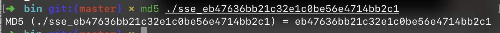
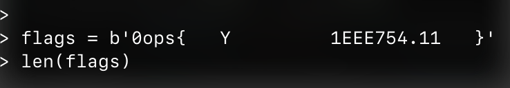
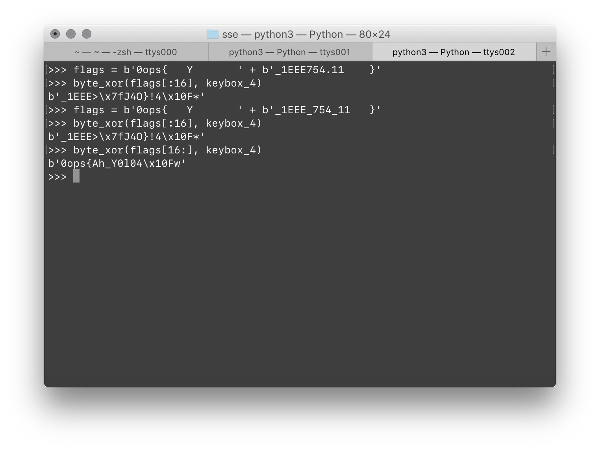

# sse

> Reverse 题都这么惜字如金的吗



首先，文件名里那一大串是他的 MD5 Digest。

只能边读边还原源代码了。

要求输入 32 个字母。考虑到标准的 Flag 格式，真正的 Body 应该就 26 个字符。

> 嗅到了字母表的气息

首先，需要理解代码中大量的 128 位数字操作指令。

`UNPCKLPD` 就是用来构造 128 位数字的。这个用 C 写调试起来非常笨拙。所以干脆用 Python 来写。

```python
flags = b'0ops{0_______Y_________________}'

assert(len(flags) == 32)

mul_1 = int.from_bytes(flags[:8] + flags[:8],
                       byteorder='little') * int.from_bytes(keybox_1, byteorder='little')
mul_2 = int.from_bytes(flags[8:16] + flags[8:16],
                       byteorder='little') * int.from_bytes(keybox_2, byteorder='little')

buf = (mul_1 + mul_2) ^ int.from_bytes(keybox_3, byteorder='little')

print(buf)

if buf % 2 ** 128 != 0 or flags[0] != 48 or flags[8] != 89:
    print("Fail~ sum mismatch")
    exit(-1)
```

前半部分大数乘法看不懂。

但是，後面这部分还是比较清楚的：

```python
xorr = int.from_bytes(
    flags[:16], byteorder='little') ^ int.from_bytes(flags[16:32], byteorder='little')

if xorr != int.from_bytes(keybox_4, byteorder='little'):
    print("Fail~ xor mismatch")
    exit(-2)
```

要求把输入 Flag 中的後 16 个字节和前 16 个字节做 XoR 的结果是特定的 `keybox_4`。

考虑到下面的事实：

`X ^ Y = Z`，因此 `X ^ Y ^ Y = Z ^ Y = Y ^ Z`。

而 `Y ^ Y = 0`，因此 `X ^ 0 = Y ^ Z`。

又因为 `X ^ 0 = X`，所以 `X = Y ^ Z`。

代入我们的情况，我们可以了解到

`flags[:16] ^ flags[16:] = keybox_4`，

所以 `flags[16:] = flags[:16] ^ keybox_4`。

我们知道大部分的 `flags[:16]` 和 `keybox_4`，所以可以凑出大部分的 `flags[16:]`。

```
b'_1EEE>\x7fJ4O}!4\x10F*'
  ^^^^^      ^
```

发挥一下人类的想象力：

```
b'_1EEE_754      }' # flags[16:]
  ^^^^^???^______^
```

> `^` 代表已经确定的值。
>
> `?` 代表猜出来的值。
>
> `_` 代表目前未知的值。

把已经知道的部分再次填入 `flags`。



再次用 `keybox_4` 反演猜出更多的数字：



反复使用

```python
byte_xor(flags[16:], keybox_4)
```

和

```python
byte_xor(flags[:16], keybox_4)
```

在循环足够多次之后，可以对称地填好这些表：

```python
flags = b'0ops{Ah_Y0u_KnOw' + b'_1EEE_754_(^_^)}'
```

> 好惭愧，实际上我并不知道 IEEE 754 在本题中的作用…